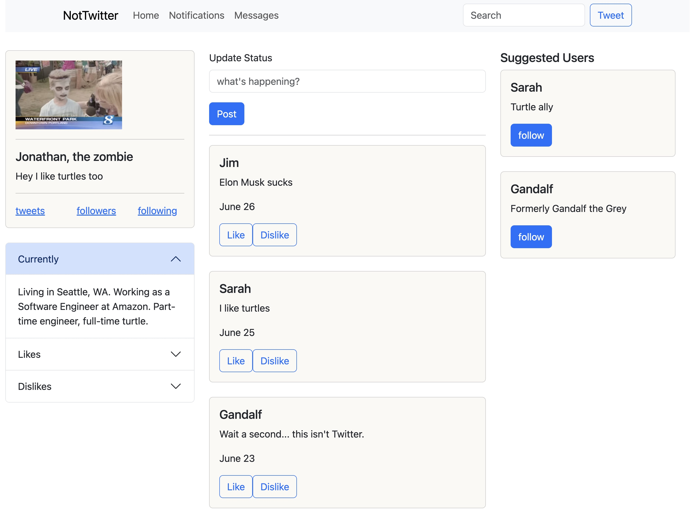
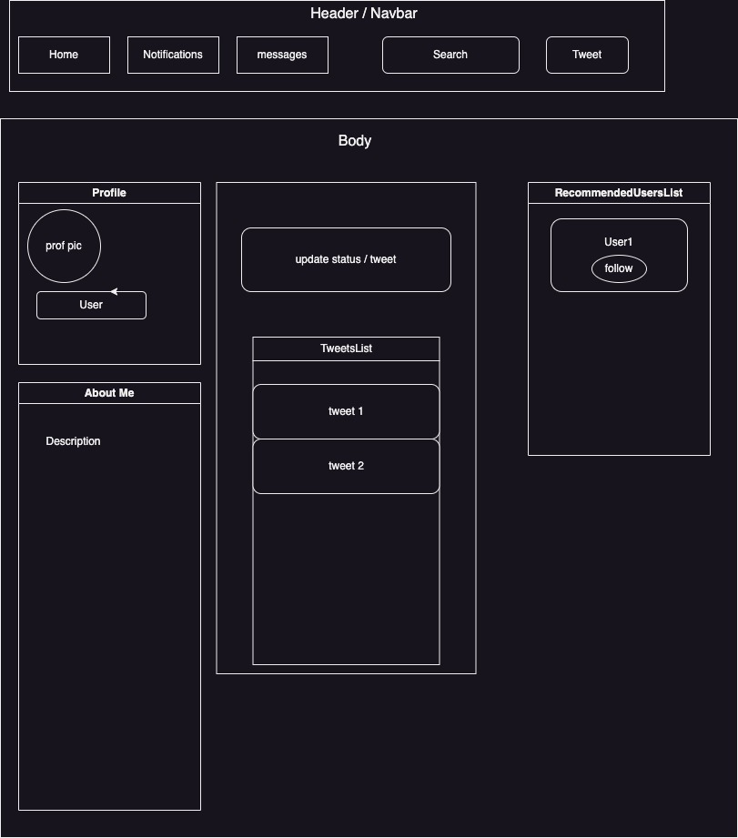

# Social Media Clone

#### A static social media website inspired by Twitter, built with JavaScript & React

#### By Gareth Grindeland and Laura Hope

## Technologies Used

* Git
* JavaScript
* React
* HTML & CSS
* Bootstrap version 5.2.3

## Description
_This is a simple static website built using npm's create-react-app startup. This project was created to practice implementing function components, prop types, and ES6 React Classes._

## Website Image


## Component Diagram


## Setup/Installation Requirements
_[Setup Instructions](https://github.com/gareth-24/SocialMediaClone/blob/main/social-media-clone/create-react-app-readme.md)_
1. Clone this project to your local machine using the following command:
```
git clone https://github.com/gareth-24/SocialMediaClone
```
2. Open the ``social-media-clone`` directory within your CLI
3. Install all Node packages and dependencies with the command `npm install`
4. Package and open the project in your browser using `npm run start`


## Known Bugs

* _No known bugs as of 6/26/23_
* _Limited functionality due to static-only state (all buttons and links are not active)_


## License

_[MIT License](https://github.com/gareth-24/SocialMediaClone/blob/main/License.txt)_